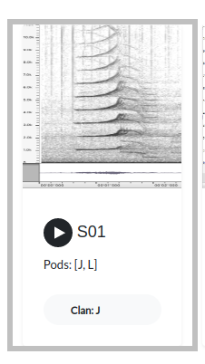

# Catalog formatting

Each `catalog` must adhere to the structure portrayed below

```yaml
id:
    - sample
    - call-type
fields:
    - sample
    - call-type
    - image-file
    - wav-file
    - description-file
    - pod:
        - J,K
    - clan:
        - J,L
    # Any additional fields can be added, but the above are required.
    - matrilines
    - population
calls:
- sample: 0
  call-type: S01
  image-file: srkw-call-catalogue-files/media/S01-J,L.png
  wav-file: srkw-call-catalogue-files/media/S01-J,L.wav
  pod: J,L
  clan: J
  description-file: srkw-call-catalogue-files/call-type-description/call-type-S01.md
  # Additional fields included
  matrilines:
  population: SRKW
```
# `fields` section

Each of the `fields` corresponds to a point of data that will be used in the catalog display. There are `7 required fields` to ensure the most optimal display of the call data, but additional fields can be added to filter calls. 

## Required `fields`
- sample
  - A unique identification number beginning at 0
- call-type
  - The unique name of the call
- image-file
  - Path to the image file
- wav-file
  - Path to the sound file
- description-file
  - Path to the markdown description file
- pod
  - Pod data for the call
- clan
  - Clan data for the call

Each of the above must be included in the `fields` section of the .yaml file, as well as in each additional entry in the `calls` section.


Valid `fields` section
```yaml
fields:
    - sample
    - call-type
    - image-file
    - wav-file
    - description-file
    - pod:
        - J,K
    - clan:
        - J,L
    - matrilines
    - population:
        - NRKW,SRKW,TRANSIENT

    # contains all required fields and additional 'matrilines' and 'population' fields
```

Invalid `fields` section
```yaml
fields:
    - sample
    - call-type
    - image-file
    - wav-file
    - description-file
    - pod:
        - J,K
    - population:
        - NRKW,SRKW,TRANSIENT
    
    # Missing the 'clan' required field
```

## Filtering `fields`

Each of the entires in `fields` can be used to filter the results displayed in the catalog. Which fields to filter on and the allowable values must be specified in the `fields` section.

To allow for filtering add the field entry as a key to a value of allowable values for the field.

```yaml
fields:
    - sample
    - call-type
    - image-file
    - wav-file
    - description-file
    - pod:
        - J,K,Unknown # Calls can be filtered by the pod values 'J','K', and 'Unknown'
    - clan:
        - J,L # Calls can be filtered on clan values 'J' and 'L'
    - matrilines
    - population:
        - NRKW,SRKW,TRANSIENT # Calls can be filtered on population values 'NRKW', 'SRKW', and 'TRANSIENT'
```
Each entry that is specified will create an additional dropdown menu to filter on in the catalogue.

# `calls` section

Each entry in the class section represents a call to display in the catalogue

## Required `calls`

All of the entries must contain all of the fields specified in the `fields` section of the catalogue file. 

Valid `calls` section
```yaml
fields:
    - sample
    - call-type
    - image-file
    - wav-file
    - description-file
    - pod:
        - J,K
    - clan:
        - J,L
    - matrilines
    - population:
        - NRKW,SRKW,TRANSIENT
calls:
  - sample: 0
    call-type: S01
    image-file: srkw-call-catalogue-files/media/S01-J,L.png
    wav-file: srkw-call-catalogue-files/media/S01-J,L.wav
    pod: J,L
    clan: J
    description-file: srkw-call-catalogue-files/call-type-description/call-type-S01.md
    matrilines:
    population: SRKW

  # Each of the entries in 'fields' is in the 'calls' entry
```

Invalid `calls` entry
```yaml
fields:
    - sample
    - call-type
    - image-file
    - wav-file
    - description-file
    - pod:
        - J,K
    - clan:
        - J,L
    - matrilines
    - population:
        - NRKW,SRKW,TRANSIENT
calls:
  - sample: 0
    call-type: S01
    image-file: srkw-call-catalogue-files/media/S01-J,L.png
    wav-file: srkw-call-catalogue-files/media/S01-J,L.wav
    pod: J,L
    clan: J
    description-file: srkw-call-catalogue-files/call-type-description/call-type-S01.md
    matrilines:
    # missing population field

  # Invalid entry. It must contain all of the fields in 'fields' section
```

Values in the `calls` section may be left blank, however this will result in the field data of `Unknown` for that call. If values are left as `Unknown` ensure that it is added as one of the filters in the `fields` section if it is a filterable field. 

Valid entry with blank fields
```yaml
fields:
    - sample
    - call-type
    - image-file
    - wav-file
    - description-file
    - pod:
        - J,K
    - clan:
        - J,L
    - matrilines
    - population:
        - NRKW,SRKW,TRANSIENT
calls:
  - sample: 0
    call-type: S01
    image-file: srkw-call-catalogue-files/media/S01-J,L.png
    wav-file: srkw-call-catalogue-files/media/S01-J,L.wav
    pod: # value will default to 'Unknown'
    clan: J
    description-file: srkw-call-catalogue-files/call-type-description/call-type-S01.md
    matrilines:
    population: # value will default to 'Unknown'

  # May leave blank fields, but they must still be present
```

# Displaying Catalog Data

Each of the required entries in the `fields` section will be displayed with the values given in each `call` entry

## Sample display data 


The corresponding `fields` and `calls` categories for the above would look as follows
```yaml
fields:
    - sample
    - call-type
    - image-file
    - wav-file
    - description-file
    - pod:
        - J,K,L # Options to filter on
    - clan:
        - J,L

calls:
  - sample: 0
    call-type: S01
    image-file: srkw-call-catalogue-files/media/S01-J,L.png
    wav-file: srkw-call-catalogue-files/media/S01-J,L.wav
    pod:
      - J,L
    clan: J
    description-file: srkw-call-catalogue-files/call-type-description/call-type-S01.md

  # Each of the specified data fields are shwon in the catalog
```